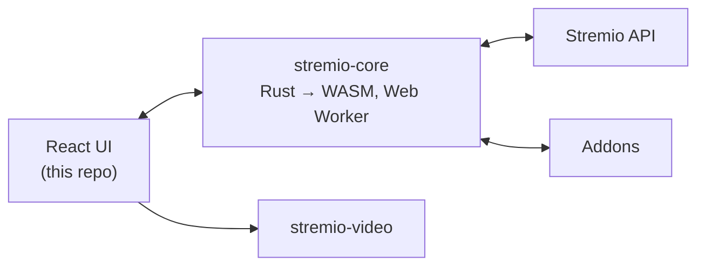

<div align="center">


# Stremio Web

**Freedom to Stream** — the official web UI of [Stremio](https://www.stremio.com), a modern media center that's a one-stop solution for your video entertainment.

[](https://github.com/Stremio/stremio-web/actions/workflows/build.yml)
[](https://stremio.github.io/stremio-web/development)
[](https://github.com/Stremio/stremio-web/releases)
[](/LICENSE.md)

**[🌐 Open the Web App](https://web.stremio.com)** · [Website](https://www.stremio.com) · [Report a bug](https://github.com/Stremio/stremio-web/issues/new/choose)


</div>

## ✨ Features

- 🧩 **Addon-powered** — discover movies, series and channels from catalogs provided by [addons](https://web.stremio.com/#/addons)
- 🔄 **Sync everywhere** — your library and Continue Watching follow your Stremio account across devices
- 📺 **Casting** — play on the big screen via Chromecast
- 💬 **Subtitles** — addon-provided or local, with customizable styling
- ⌨️ **Keyboard-first player** — full playback control without touching the mouse
- 🌍 **50+ languages** — community-translated via [stremio-translations](https://github.com/Stremio/stremio-translations)
- 📱 **Installable** — runs as a standalone PWA

## 📸 Screenshots

| Discover | Meta Details |
|:---:|:---:|
|  |  |

## 🛠 How it works

The UI (this repo) is a React app, but the brains live in [stremio-core](https://github.com/Stremio/stremio-core) — Stremio's Rust engine compiled to WebAssembly and running in a Web Worker. The UI renders state, the core computes it. Playback goes through [stremio-video](https://github.com/Stremio/stremio-video), which picks the right player implementation for the environment.



## 🚀 Getting started

You'll need [Node.js](https://nodejs.org) 22+ and [pnpm](https://pnpm.io/installation) 11+.

```bash
pnpm install
pnpm start
```

The dev server runs at `http://localhost:8080`.

| Command | Description |
|---|---|
| `pnpm start` | Development server with hot reload |
| `pnpm run start-prod` | Development server in production mode |
| `pnpm run build` | Production build |
| `pnpm test` | Run tests |
| `pnpm run lint` | Lint the source |
| `pnpm run scan-translations` | Check for missing translation keys |

### 🐳 Docker

```bash
docker build -t stremio-web .
docker run -p 8080:8080 stremio-web
```

## 🤝 Contributing

Bug reports and pull requests are welcome — [`good first issue`](https://github.com/Stremio/stremio-web/labels/good%20first%20issue) is a great place to start. Want Stremio in your language? Contribute to [stremio-translations](https://github.com/Stremio/stremio-translations). Please read the [Code of Conduct](/CODE_OF_CONDUCT.md) first.

## 🧩 Ecosystem

| Repository | What it is |
|---|---|
| [stremio-core](https://github.com/Stremio/stremio-core) | Rust engine: state, addon protocol, library, sync |
| [stremio-video](https://github.com/Stremio/stremio-video) | Video player abstraction used by this UI |
| [stremio-translations](https://github.com/Stremio/stremio-translations) | Community translations |
| [stremio-addon-sdk](https://github.com/Stremio/stremio-addon-sdk) | Build your own addon in Node.js |

## 💬 Community

[Website](https://www.stremio.com) · [Blog](https://blog.stremio.com) · [Reddit](https://www.reddit.com/r/Stremio) · [X](https://x.com/stremio) · [Help center](https://stremio.zendesk.com/hc/en-us)

## 📄 License

Copyright © 2017-2026 Smart Code OOD. Released under the GPL-2.0 license — see [LICENSE](/LICENSE.md).
