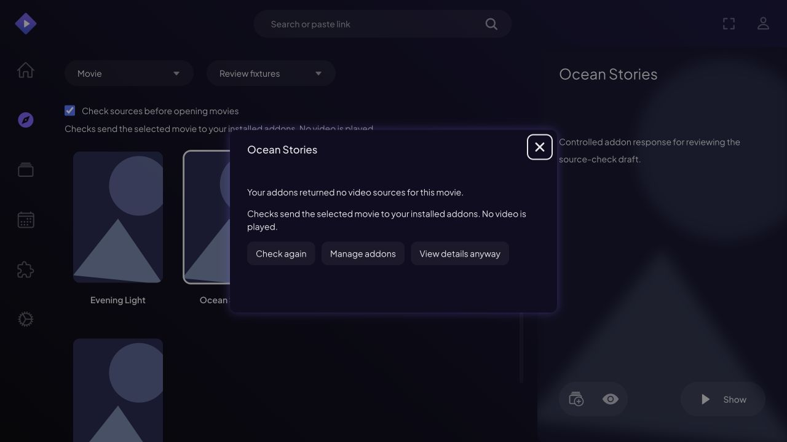
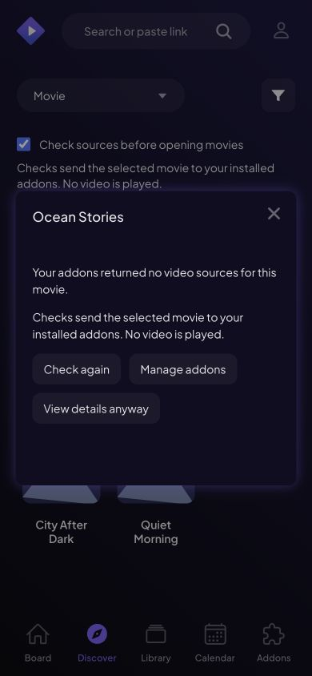

# Review the movie source check

The first implementation adds an opt-in **Check sources before opening movies** control in Discover. With it enabled, selecting a movie opens a source-check dialog in the current browsing screen. It shows whether addons returned sources, returned nothing, failed, or provided only external links. Users can view sources after a positive result, retry, manage addons, or explicitly view details anyway.

The source result is not a promise that a video will play on the current device. That limitation is stated in the dialog.

## What is implemented

- Discover movie-card navigation and the selected movie's matching preview link are intercepted when the control is enabled. Modified clicks and links opened in a new tab retain their existing behavior.
- Checks are explicit and operate on one movie. Enabling the control alone makes no source requests.
- The dialog uses the core `source_preview` model. It does not load or replace `meta_details`.
- Empty responses and failed checks have different messages and useful next actions.
- Late responses are ignored after cancellation, retry, and profile changes. Closing the dialog keeps the user in Discover.
- The dialog stops waiting after 15 seconds. This unloads the logical check; the transport may still finish requests already issued.
- Status is announced to screen readers. The existing modal supplies focus management and Escape handling.
- A core package without the new model produces an explanatory fallback, rather than crashing Discover.

## Dependencies and local review

This draft depends on the [core PR #1056](https://github.com/Stremio/stremio-core/pull/1056) and [translation PR #1116](https://github.com/Stremio/stremio-translations/pull/1116). The translation dependency is temporarily pinned to the exact fork commit so reviewers can see the actual English messages. Replace it with the upstream commit after merge.

The public `@stremio/stremio-core-web` package does not yet contain `source_preview`. Before marking this PR ready, release the core change and update that dependency. Until then, build and link the companion branch locally:

```sh
# In stremio-core, on check-movie-sources-before-navigation:
cd stremio-core-web
npm ci
npm run build-dev

# In stremio-web:
pnpm install --frozen-lockfile
pnpm link ../stremio-core/stremio-core-web
pnpm start
```

The relative link assumes the repositories are siblings. `pnpm link` may add a local override to the workspace configuration; keep that machine-specific change out of the PR. The WASM build requires the normal Rust/WASM toolchain described by stremio-core.

## Review paths

- `src/routes/Discover/Discover.js`: opt-in control and navigation interception.
- `src/routes/Discover/SourceCheckDialog.tsx`: subscriptions, status messages, deadline, retry, and next actions.
- `src/routes/Discover/SourceCheckDialog.less`: dialog layout and focus styling.
- Companion core `src/models/source_preview.rs`: isolated requests, generation invalidation, and classification.
- Companion core `src/unit_tests/source_preview.rs`: controlled response tests.

The comments in core explain two non-obvious rules: embedded sources must have the same precedence as details, and this check must not trigger library or rating work.

## What this draft does not implement

It does not hide all unavailable movies in advance, check a whole catalog, check Board/Search, or check individual episodes. The broader [proposal](proposals/source-aware-browsing.md) describes those extensions.

The control is initially off and lasts for the mounted Discover route. Results are not cached across dialogs, so reopening a movie makes a fresh check. There is no background request scheduler or video compatibility probe. These boundaries keep the first implementation reviewable and avoid claiming that the whole proposal is complete.

## Validation

Core: the normal root suite passes 246 unit tests and 18 documentation tests, including eight new source-preview tests. Clippy passes with warnings denied. A workspace-wide test run exposes an existing JSON key-order failure, reproduced on unchanged development; see the core PR.

Web: lint passes with existing warnings, all 70 existing tests pass, and the production build passes with bundle-size warnings. The translation scan passes when invoked with the installed Jest (`pnpm exec jest ./tests/i18nScan.test.js`); the script’s `pnpx` executable is unavailable in the validation runtime. A standalone TypeScript check reports errors elsewhere in the existing project; the same baseline problems were reproduced on unchanged development, and no error was reported for the new dialog. No new web test file was added, following the repository's contribution policy.

Translations: syntax and key-order suites each pass 51 assertions. Existing CRLF line endings are preserved.

The combined local web/WASM build was exercised with a controlled addon containing five fictional movies. Verified: positive sources and navigation to the matching source list, empty sources, HTTP 503 failures, external-only links, the 15-second timeout, Escape dismissal, Enter activation, Tab focus inside the dialog, focus restoration to the selected movie, and return to Discover. The fixture server recorded zero requests to the video URL. The dialog was visually inspected at desktop width and at 390 × 844; a text-contrast issue found during inspection was fixed.

The screenshots below use fictional titles and controlled responses, not real availability claims.




